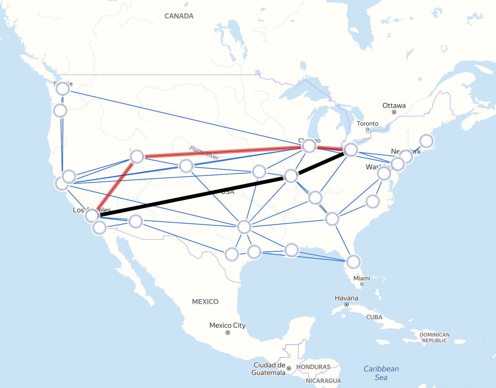

# Management_of_SDN_network
Построения сети управления в SDN сети

# Зависимости
Для работы приложения необходима версия языка Python 3.6 и выше.
Используются стандартные библиотеки. 

# Запуск
Формат данных:

1)-t <имя файла топологии> – из библиотеки TopologyZoo в формате GraphML.

2)Дополнительный параметры k1 и k2. 

Пример запуска программы:

```
>>> python3 ./main.py -t tests/AttMpls.graphml -k1 3 -k2 22
Parsed arguments:
destination_node_id = 22
file_name = tests/AttMpls.graphml
source_node_id = 3
Parsed 25 nodes
Parsed 114 edges
Parsed graph: G(25 nodes, 114 edges)
Written topology to file tests/AttMpls.graphml_topo.csv
Written routes to file tests/AttMpls.graphml_routes.csv
Visualization available at file tests/AttMpls.graphml_demo.html
```

Программа формирует два csv файла и HTML файл с визуализацией графа:

1)CSV файл с описанием каналов связи сети в порядке возрастания id узлов.

2)CSV файл с описанием остовного дерева.
Прямой путь обозначается черным, резервный - красным.

Для вычисления расстояния между узлами сети, зная их географические координаты, 
используется формула: 
[greate-circle distance](https://en.wikipedia.org/wiki/Great-circle_distance).

# Визуализация графа
